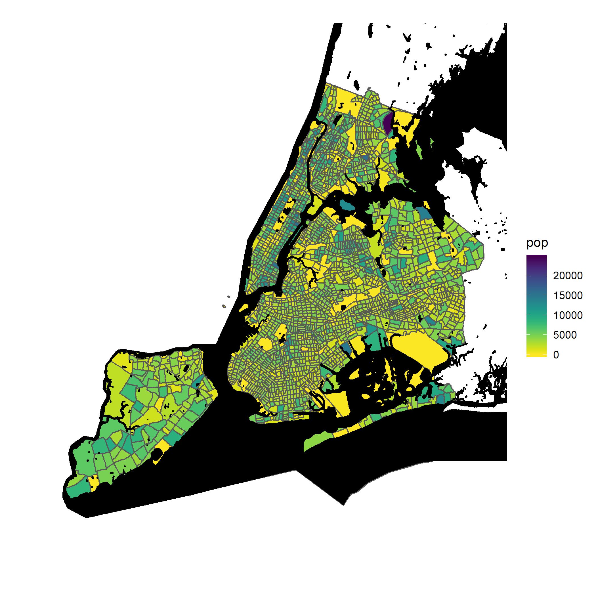

<!-- README.md is dyanamically generated.  Do Not Edit. -->
<!-- Please, YOU CAN edit the .Rmd file -->

## QUESTION
This repo documents a question where the patron wanted to improve the visualization of a choropleth mapping a variables over census tracts.  The choropleth was find but the field surround the polygons was not descriptive.  The hope was that adding more mapping detail would help clarify the geography.

## SOLUTION

Using the `sf` package and `ggplot::geom_sf` along with a layer of hydrography, I was able to overlay the water coastline on top of the choropleth.  This method overcomes the problem created where census tracts actually extend over coastlines and obscure the land-mass geography.  

## Inverting colors for Printing.

Using `scale_fill_viridis(direction = -1)` reverses the color scheme automatically selected by the viridis package.  I did this because printing to a black and white printer makes the standard viridis color ramp appear inverted. (to my eyes.)

```{r echo=FALSE}

```

## Code

``` r
ggplot() +
  geom_sf(data = borroughs, aes(fill = pop)) +
  viridis::scale_fill_viridis(direction = -1) +
  geom_sf(data = coast, color = "black", fill = "black") +
  coord_sf(xlim = c(-73.7, -74.3), ylim = c(40.45, 40.95)) + 
  theme(panel.background = element_rect(fill = "transparent"), 
        panel.grid.major = element_line(color = "transparent"), 
        axis.text.x = element_blank(), 
        axis.text.y = element_blank(), 
        axis.ticks = element_blank())

```

